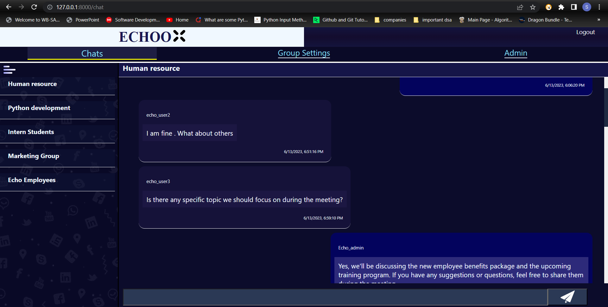
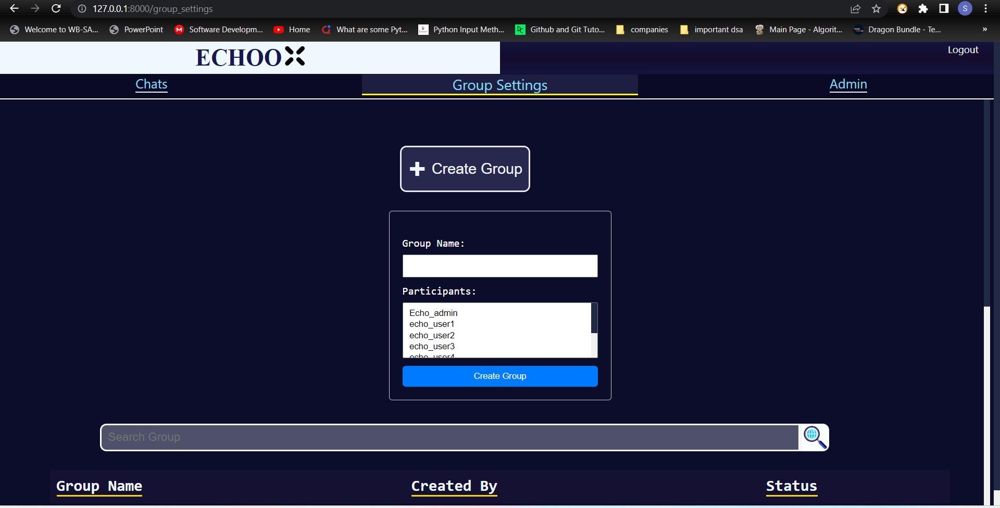
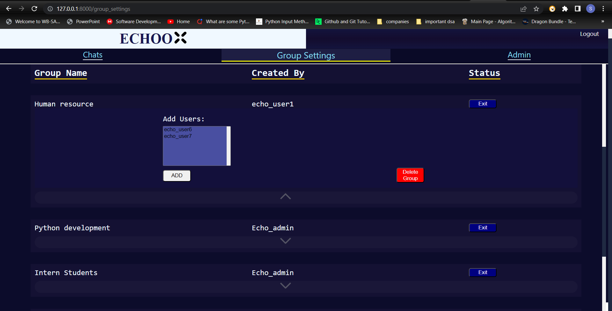

# Echoo-Live-Chat-Application
Live Web Chatting Application made using ReactJs and Django

## Chat Application using Django Channels

This is a live web application for chatting that utilizes the WebSocket protocol and is built with Django Channels.


## About Django Channels

Django Channels is a powerful library for handling WebSockets and other asynchronous protocols in Django. It allows you to build real-time applications such as chat systems, notifications, and collaborative platforms. With Channels, you can integrate WebSockets seamlessly into your Django project, enabling bidirectional communication between the server and clients.



## Instructions to Run the Application

To run the application on your computer, follow these steps:

1. Clone the repository:

   ```
   git clone <https://github.com/Siddhant0507Shekhar/Echoo-Live-Chat-Application>
   ```




2. Navigate to the main Django project folder:
   ```
   cd echo_backend/Echo_back
   ```

3. Create a virtual environment and activate it:
   
     a.  Create virtual environment
   
   ```
   python -m venv myenv
   ```

     b.  Activate virtual environment
   
   ```
   source myenv/bin/activate
   ```
   


4. Install the required packages from the `requirements.txt` file:
   
   ```
   pip install -r requirements.txt
   ```

5. Run a Redis server for in-memory database. It is easiest to run through docker images using the below command. So make sure u have docker installed on your system:
   
      ```
      docker run -p 6379:6379 -d redis:5
      ```

6. Apply migrations:
   
      ```
      python manage.py makemigrations
      ```
      
   then finally migrate
   
      ```
      python manage.py migrate
      ```

7. Start the development server:
    
      ```
      python manage.py runserver
      ```

8. Now you can access the application in your web browser at `http://localhost:8000/`


Feel free to modify the instructions and add any additional information specification
